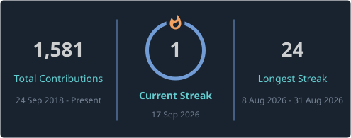

<h3>Royan Gagas Pradana</h3>

<b>System Analyst &nbsp;·&nbsp; Fullstack Engineer</b> 
3+ years turning business requirements into systems that ship &nbsp;·&nbsp; Indonesia

<i>Specifications are only worth what they save the team that builds from them.</i>

  

---

## What I do

I work where business requirements turn into systems. Currently **System Analyst** for vehicle financing (multifinance) at **SEVA (Astra Group)**, where I design module and API contract structure for the NestJS + TypeORM backend and trace issues through providers, guards, and interceptors when something breaks.

- **Specify** — technical specification documents, system architecture, ERD and data models, REST API contracts in OpenAPI 3.0, plus the task breakdown that gets them built.
- **Ship** — Next.js, TypeScript, and Node in production. I architected SEVA's multifinance platform from zero to Phase 2 and designed its 105 REST API endpoints across Agency and CMS Agency.
- **Tool** — I build the tooling that produces those artifacts, because writing specs by hand does not scale. Two of those tools are open source below.

## Tech I work with

**Also in the toolbox:** OpenAPI 3.0 and REST contract design, Drizzle ORM, tRPC, Hono, Tauri 2, DBML and PlantUML modeling, CI/CD on VPS, Jest and Vitest.

## Featured projects

| Project | What it does |
| --- | --- |
| **[Labas Bahasa](https://github.com/rogasper/labas-bahasa)**     | AI-powered language exam practice for JLPT, TOPIK, and TOEFL. Built solo, end to end: Next.js front end, TypeScript APIs, PostgreSQL + Prisma schema, and an LLM orchestration layer for adaptive question generation. **134 active users**, and the first project I shipped that people outside my own circle actually use. |
| **[Onesist](https://github.com/rogasper/onesist)**    | Desktop and web workspace that turns raw FSD documents into analyst deliverables: specifications, ERD, API contracts, phased task backlogs, SIT cases, and RTM traceability. Includes an ERD Studio with SQL and DBML export, a phase-grouped task manager with story points, and Jira and Monday export. Tauri 2 with a Rust and Bun sidecar, SQLite in WAL mode, Drizzle ORM. |
| **[System Analyst Skill](https://github.com/rogasper/system-analyst-skill)**    | Portable agent skill that converts Functional Specification Documents into developer-ready artifacts inside AI coding assistants: DBML data models, PlantUML diagrams, OpenAPI 3.0 contracts, task cards with story points, SIT test cases, and RTM traceability. Backed by Python validators and eval scenarios, plus a Monday.com board export to SRS generator that emits Markdown and Word. |
| **[Reurci](https://github.com/rogasper/reurci)**    | Job-description-driven resume assistant that rewrites work history and curates skills while keeping the user in editorial control: per-section approve, edit, and retry, versioned snapshots, rules-based JD match scoring, and one-click ATS-friendly PDF export. Turborepo monorepo with TanStack Start, Hono + tRPC, PostgreSQL + pgvector, and Mastra agents. |
| **[CapBall](https://github.com/rogasper/capball)** | Local-first desktop app for football match analysis. Import your own match video, tag moments with one keystroke while watching, then export clips around those moments. Everything runs on the machine: no backend, no upload, no account. |

## GitHub

---

I write about the engineering behind these projects at <a href="https://rogasper.com">rogasper.com</a>. Open to System Analyst and fullstack conversations.

